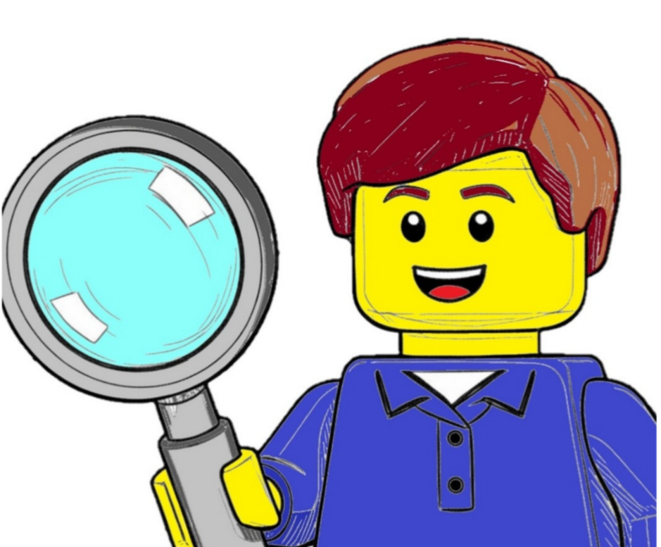

# Suomen Palikkaharrastajat ry

<search/>

## Mitä?

Suomen Palikkaharrastajat ry on LEGO-harrastajien oma rekisteröity yhdistys. Yhdistys kokoaa yhteen LEGO-harrastajia, järjestää harrastusta tukevaa toimintaa, tukee jäseniään omien LEGO-tapahtumien järjestämisessä ja osallistuu muiden järjestämiin tapahtumiin. Pidämme palikoista monipuolisena harrastuksena – riippumatta LEGO-yhtiöstä.

## Missä?

Yhdistyksen jäseniä ja muita LEGO-harrastajia löydät netistä ainakin [Palikkatakomo ry:n Discord-palvelimelta](https://discord.gg/Xn9GWT485J) tai [Palikkatakomo ry:n foorumilta](https://www.palikkatakomo.org/forum/). Meitä näkyy myös livenä näyttelyissä ja muissa harrastukseen sopivissa tapahtumissa. Yhdistyksellä myös [oma keskustelualue](https://forum.palikkaharrastajat.fi) toiminnan suunnitteluun.

PS. Lisää tietoa LEGO-harrastuksesta löydät myös [Palikkatakomo ry:n kotisivuilta](https://www.palikkatakomo.org/). Palikkatakomon on Suomen virallinen LUG eli LEGO Users Group.

## Palvelut

Juuri nyt yhdistys ylläpitää ja kehittää harrastuksesta tietoa jakavia verkkopalveluita:

<feature-grid columns="2">

<feature title="Palikkakalenteri" icon="calendar" href="https://kalenteri.palikkaharrastajat.fi">

**Palikkakalenteri** on yhteisöllisesti ylläpidettävä kalenteri harrastukseen liittyvistä tapahtumista erityisesti Suomessa. [Tilaa tästä kalenteri puhelimeesi.](webcal://kalenteri.palikkaharrastajat.fi/kalenteri.ics)

</feature>

<feature title="Palikkalinkit" icon="rss" href="https://linkit.palikkaharrastajat.fi/">

**Palikkalinkit*** on päivittyvä vilkaisu kotimaisten harrastajien tuottamaan sisältöön, ja sisältää myös muutaman noston kansainvälisestä tarjonnasta. Sivustolle voidaan lisätä julkisia "syötteitä" (RSS, ATOM, ...) tarjoavia palveluita ja sivustoja.

</feature>

</feature-grid>

Lisää tietoja löydät [yhdistyksen jäsenyyden yhteydestä](jasenyys).

## Yhteistyökumppanit

<feature-grid columns="2" align="center">
<feature title="Panttilan Palikka" href="https://pattilanpalikka.sumupstore.com">

</feature>
<feature title="Joshua's Train Bricks" href="https://store.bricklink.com/joshuatrain">

</feature>
</feature-grid>